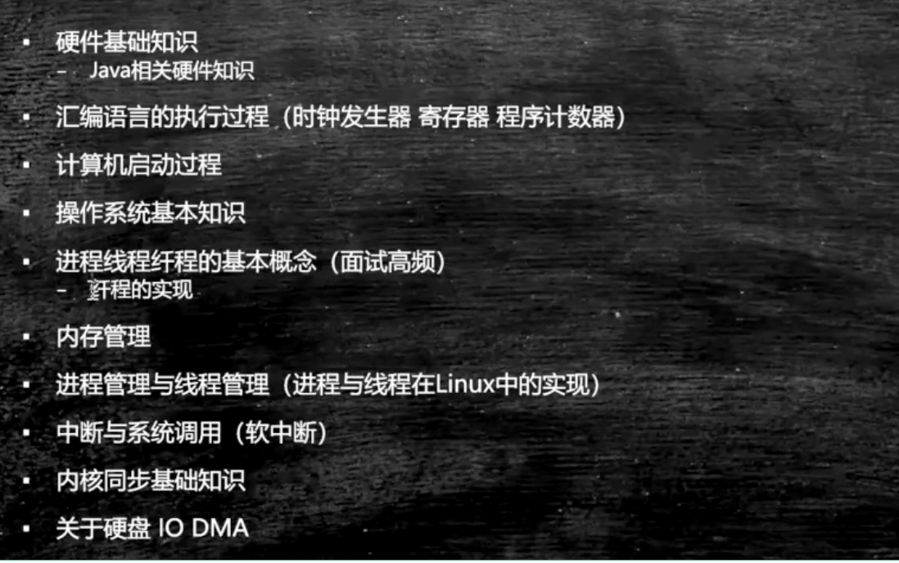
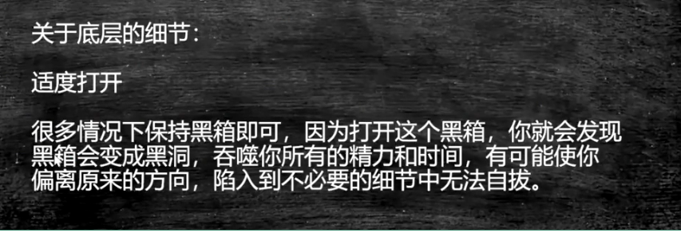
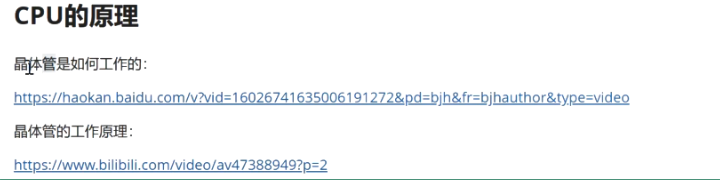

# 计算机底层知识（java）

## 目录：

## 推荐书籍：

不求甚解，观其大略

- 《编码：隐匿在计算机软硬件背后的语言》
- 《深入理解计算机系统》
- **语言：C JAVA  后续有精力学C二选一：《C程序设计语言》《C Primer Plus》**
- **数据结构与算法：--毕生的学习 leetCode**
- 	《Java数据结构与算法》《算法》
- 	*《算法导论》 //难《计算机程序设计艺术》//难*
- 操作系统：Linux内核源码解析 30天自制操作系统
- 网络：机工《TCP/IP详解》卷一 翻译一般
- 编译原理：机工 龙书--《编译原理》《编程语言实现模式》
- 数据库：SQLite源码 Derby--JDK自带的数据库

适度打开

很多情况下保持黑箱即可，因为打开这个黑箱，你就会发现黑箱会变成黑洞，吞噬你所有的精力和时间，有可能使你偏离原来的方向，陷入到不必要的细节中无法自拔

## 硬件的基础知识

### CPU的制作过程

Intel cpu的制作过程

https://haokan.baidu.com/v?vid=11928468945249380709&pd=bjh&fr=bjhauthor&type=video

CPU是如何制作的

https://www.sohu.com/a/255397866_468626

**生态**

### CPU的原理

计算机需要解决的最根本问题：如何代表数字

