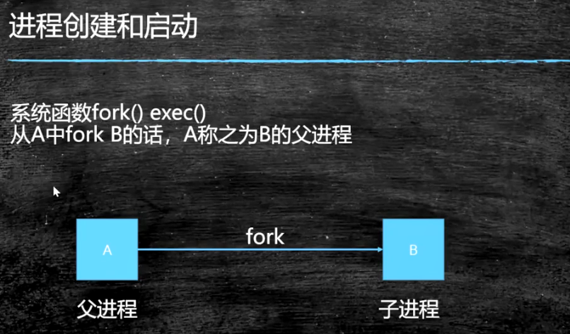
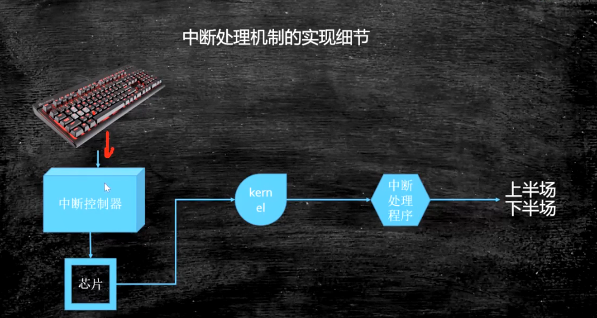

# 计算机底层知识（java）


## 目录：


## 推荐书籍：

**不求甚解，观其大略**


- 《编码：隐匿在计算机软硬件背后的语言》
- 《深入理解计算机系统》
- **语言：C JAVA  后续有精力学C二选一：《C程序设计语言》《C Primer Plus》**
- **数据结构与算法：--毕生的学习 leetCode**
- 	《Java数据结构与算法》《算法》
- 	*《算法导论》 //难《计算机程序设计艺术》//难*
- 操作系统：Linux内核源码解析 30天自制操作系统  **Linux内核设计与实现**
- 网络：机工《TCP/IP详解》卷一 翻译一般
- 编译原理：机工 龙书--《编译原理》《编程语言实现模式》
- 数据库：SQLite源码 Derby--JDK自带的数据库


适度打开

很多情况下保持黑箱即可，因为打开这个黑箱，你就会发现黑箱会变成黑洞，吞噬你所有的精力和时间，有可能使你偏离原来的方向，陷入到不必要的细节中无法自拔


## 硬件的基础知识


### CPU的制作过程

Intel cpu的制作过程

https://haokan.baidu.com/v?vid=11928468945249380709&pd=bjh&fr=bjhauthor&type=video

CPU是如何制作的

https://www.sohu.com/a/255397866_468626

**生态**


### CPU的原理

计算机需要解决的最根本问题：如何代表数字


### 汇编语言（机器语言）的执行过程

**汇编语言的本质：机器语言的助记符 其实它就是机器语言**


DMA：Direct Memory Access 直接内存访问


```markdown
总线现在64bit的比较多

64位的寄存器可以当32位寄存器使用
64位的CPU指寄存器一次可以存储64位的数字，ALU与寄存器也有电路连接，它们之间电路一次也可以读取64位
```


### 量子计算机


量子比特，同时表示0，1


### java相关硬件知识

cpu和内存是计算机的核心

### CPU的基本组成


**PC -> Program Counter 程序计数器（记录当前指令地址）**

**Registers -> 寄存器，暂时存储CPU计算需要用到的数据**
**ALU -> Arithmetic & Logic Unit 运算单元**

**CU -> Control Unit 控制单元**

**MMU -> Memory Management Unit 内存管理单元**

**cache -> 缓存（为什么需要缓存，因为CPU速度比内存速度快很多，每次去内存取数据就太慢了）**


**context switch 线程上下文切换：将上一个正在运行的线程的寄存器和指令存储起来，把下一个线程需要的数据放过来**
**切换是需要消耗cpu，效率比较低（一个核心对应一个线程）**
**超线程：一个核心对应两个线程，一个运算单元对应多套寄存器和程序计数器**


一颗CPU对应多核，如下图，黄色框对应一颗CPU，里面是双核，每个核心有自己的L1、L2，两个封装在一起的核心共享一个L3，两颗CPU共享主内存


**按 块读取数据**：一般来讲，从任何一个存储单元，不管是内存、L1、L2、L3、硬盘，读取数据都是按块来读取

**程序局部性原理**：读取了某个数据后，按程序来讲，它应该很快用到它相邻的数据，如果一个一个的读取数据，势必效率会很低，所以按块读取来提升效率

*硬盘读取数据是不是CPU读取数据到内存？*

```markdown
明显不是，CPU的64个寄存器能存放多少数据呢，DMA直接发送一个指令，这条指令告诉硬盘，把相应的数据读取到内存的某个位置，硬盘直接跟内存打交道
```


### 缓存行对齐

如下图：下面有两个核，第一个核要读取x数据，x，y相互挨着，位于同一块（同一个缓存行）

计算单元要读取x，先去L1缓存去读取，如果没有则去L2缓存读取，依次类推，最后去内存里面读取。数据返回路径，找到x所在的块（缓存行），将数据缓存到L3、L2、L1

一个核要读取x，会把y也读取进去。另外一个核要读取y，会把x也读取进去。在这种情况下，如果两个核的数据要保持一致性。实现这种情况，内部的原理是**缓存一致性协议**


Inter CPU取的64字节


```markdown
缓存行：
缓存行越大，局部性空间效率越高，但读取时间慢。缓存行越小，局部性空间效率越低，但读取时间快。
取一个折中值，目前多用：64字节（Inter CPU）
```


```java
public class CacheLinePadding {
    //@Contended  jdk8可以控制变量是否在同一个缓存行
    /**
     * 有一定概率 arr1[0]是一个缓存行的行尾，arr1[1]是一个缓存行的行头
     * 也有一定概率，arr1[0],arr1[1]是在同一个缓存行
     */
    private static volatile long[] arr1 = new long[2];
    private static volatile long[] arr2 = new long[16];

    @Test
    public void t1() throws InterruptedException {
        /*
        arr1：arr1下标为0，1的两个数挨着的
        第一颗CPU的线程只改arr1[0]的位置，第二颗CPU的线程只改arr1[1]的位置，但是线程1和2都分别把数据全读到缓存行里面的
        如果这两个数字要保持缓存一致性的话，效率会比较低
        arr2：将两个数据分别放在不同的缓存行里面
         */
        //
        Thread t1 = new Thread(() -> {
            for (long i = 0; i < 10000_0000L; i++) {
                arr1[0] = i;
            }
        });

        Thread t2 = new Thread(() -> {
            for (long i = 0; i < 10000_0000L; i++) {
                arr1[1] = i;
            }
        });

        final long start = System.nanoTime();
        t1.start();
        t2.start();
        t1.join();
        t2.join();
        System.out.println((System.nanoTime() - start) / 100_0000L);
    }
    
    @Test
    public void t2() throws InterruptedException {
        Thread t1 = new Thread(() -> {
            for (long i = 0; i < 10000_0000L; i++) {
                arr2[0] = i;
            }
        });

        Thread t2 = new Thread(() -> {
            for (long i = 0; i < 10000_0000L; i++) {
                arr2[8] = i;
            }
        });

        final long start = System.nanoTime();
        t1.start();
        t2.start();
        t1.join();
        t2.join();
        System.out.println((System.nanoTime() - start) / 100_0000L);
    }
}
```

缓存行对齐：对于有些特别敏感的数字，会存在线程高竞争的访问，为了保证不发生伪共享，可以使用缓存行对齐的编程方式

JDK7中，很多采用long padding提高效率

JDK8，加入了@Contended注解（自己做实验），需要加上 -XX:-RestrictContended 才能生效


disruptor框架，缓存行框架


### CPU的乱序执行


#### CPU层面如何禁止重排序？内存屏障

inter:lfence:读屏障，sfence:写屏障 ，mfence:读写屏障

当然也可以使用总线锁来解决


原语比lock指令效率要高

CPU层面是原语、Lock指令


#### JVM规范


#### volatile在JVM层面的实现，在CPU层面还是Lock指令


volatile修饰引用类型时，读写引用类型也会加屏障么？（官方未明确说明，自己做实现）

对CPU层面来说，只要两个指令没有依赖关系就会发生指令重排序

对于JVM来说，重排序必须遵守happens-before原则


#### 总结：禁止乱序

##### CPU层面：

	intel -> 原语（lfence:读屏障，sfence:写屏障 ，mfence:读写屏障）或者锁总线

##### JVM层面：

	8个happens-before原则 4个内存屏障（StoreStore LoadLoad StoreLoad LoadStore）

##### as-if-serial：

	不管硬件什么顺序，单线程执行结果不会改变，看上去像是serial


### 合并写（不重要）

write combing buffer 一般4字节  由于ALU速度太快，所以在写入L1的同时，写入一个WC Buffer ，满了之后，再直接更新到L2


### NUMA

UMA：多个CPU共享同一个内存


NUMA：每一组插槽有一颗CPU和相邻的内存，每颗CPU使用相邻的内存

ZGC--NUMA aware

分配内存会优先分配该线程所在CPU的最近内存


### 启动过程（不重要）

通电->bios uefi 工作 -> 自检 -> 到硬盘固定位置加载bootloader  -> 读取可配置信息 -> CMOS


## OS

### 内核分类

微内核：弹性部署 5G loT

宏内核：PC phone

外核：科研 实验室中 为应用定制操作系统


### 

### 内核态和用户态


**CPU分不同的指令级别**

**linux 内核跑在ring 0级，用户程序跑在ring 3级，对于系统的关键访问，需要经过kernel的同意，保证系统的健壮性**

**内核执行的操作 -> 200多个系统调用函数 sendfile read write pthread fork**

**JVM ->站在OS的角度，就是一个普通程序**

intel CPU分为4个级别：ring 0 - 3

linux：只用了两个级别，ring 0 ，ring 3，在内核态时可以访问ring 0级的数据，应用程序只能访问ring 3级的数据


内核空间：内存内核访问的空间

用户空间：应用程序访问的空间


## 进程 线程 纤程 中断

### 面试高频：进程和线程有什么区别？

答案：进程就是一个程序运行起来的状态，线程是一个进程中的不同的执行路径。

专业回答：进程是OS分配资源的基本单位，线程是执行调度的基本单位。分配资源最重要的是：分配独立的内存空间，线程调度执行（线程共享进程的内存空间，没有自己独立的内存空间）


### Fiber：纤程

纤程：用户态的线程，线程中的线程，切换和调度不需要进过OS

优势：1、占有资源很少 OS级别的线程占用1M Fiber 4k 2、切换比较简单 3、启动很多个10w+

目前2020 3 22 支持内置纤程的语言：Kotlin Scala Go Python(lib) ...Java?

目前Java中对纤程的支持：没有内置


JVM（Hotspot）级别的线程和操作系统的线程是一一对应的

多个纤程对应一个JVM级别的线程，纤程是跑在用户空间的


测试代码：

```java
public class FiberTest {
    
    public static void main(String[] args) throws Exception {
        long start = System.currentTimeMillis();

        int size = 10000;

        CountDownLatch latch = new CountDownLatch(size);

        for (int i = 0; i < size; i++) {
            /*new Thread(() -> {
                calc();
                latch.countDown();
            }).start();*/
            Fiber<Void> fiber = new Fiber<>((SuspendableRunnable) () -> {
                calc();
                latch.countDown();
            });
            fiber.start();
        }

        latch.await();

        System.out.println("执行完耗时: " + (System.currentTimeMillis() - start));
    }

    private static void calc(){
        int result = 0;
        for (int i = 0; i < 10000; i++) {
            for (int j = 0; j < 200; j++) {
                result += j;
            }
        }
    }
}
```

目前是10000个纤程，如果想提升效率，可以分为10份，10个操作系统级别的线程，每个线程创建1000个纤程

纤程的应用场景：1、很短的计算任务，不需要和内核打交道，2、并发量比较高的时候


linux中的进程有一个内核数据结构（PCB）


### 进程的管理

#### 进程创建和启动




#### 僵尸进程 孤儿进程


zombie.c

```c
#include <stdio.h>
#include <stdlib.h>
#include <unistd.h>
#include <string.h>
#include <assert.h>
#include <sys/types.h>

int main() {
    pid_t pid = fork();
    if(0 == pid){
        printf("child id is %d\n",getpid());
        printf("parent id is %d\n",getppid());
    }else{
        while(1){}
    }
}
```


orphan.c

```c
#include <stdio.h>
#include <stdlib.h>
#include <unistd.h>
#include <string.h>
#include <assert.h>
#include <sys/types.h>

int main() {
    pid_t pid = fork();
    if(0 == pid){
        printf("parent id is %d\n",getppid());
        sleep(10);
        printf("parent id is %d\n",getppid());
    }else{
        printf("parent id is %d\n",getpid());
        sleep(5);
        exit(0);
    }
}
```


### 进程调度


linux2.6 采用CFS Completely Fair Scheduler

按优先级分配时间片的比例，记录每个进程的执行时间，如果有一个进程执行时间不到它应该分配的比例，优先执行（按时间补偿）


#### 进程调度基本概念


#### Linux默认的调度策略

实时进程（c语言创建），优先级分高低 -> FIFO ，优先级一样的->RR（Round Robin）

普通进程 -> CFS


### 中断

操作系统级别的中断

摁下一个键盘按键后，会将当前电信号交给中断控制器，中断控制器会告诉CPU有一个键盘信号来了，CPU会在某个固定位置找到执行程序，这个执行程序会通知kernel，根据这个中断信号，在中断处理程序中找到对应的程序，



中断分为：硬中断，软中断


高并发的核心处理：分而治之