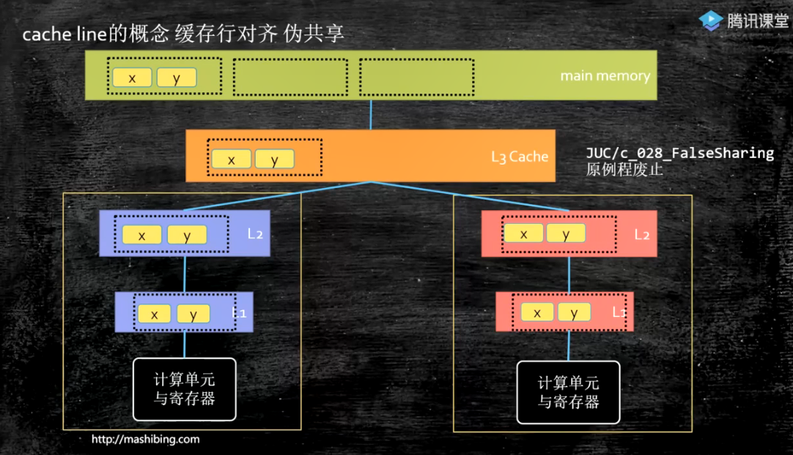

# 计算机底层知识（java）


## 目录：


## 推荐书籍：

**不求甚解，观其大略**


- 《编码：隐匿在计算机软硬件背后的语言》
- 《深入理解计算机系统》
- **语言：C JAVA  后续有精力学C二选一：《C程序设计语言》《C Primer Plus》**
- **数据结构与算法：--毕生的学习 leetCode**
- 	《Java数据结构与算法》《算法》
- 	*《算法导论》 //难《计算机程序设计艺术》//难*
- 操作系统：Linux内核源码解析 30天自制操作系统
- 网络：机工《TCP/IP详解》卷一 翻译一般
- 编译原理：机工 龙书--《编译原理》《编程语言实现模式》
- 数据库：SQLite源码 Derby--JDK自带的数据库


适度打开

很多情况下保持黑箱即可，因为打开这个黑箱，你就会发现黑箱会变成黑洞，吞噬你所有的精力和时间，有可能使你偏离原来的方向，陷入到不必要的细节中无法自拔


## 硬件的基础知识


### CPU的制作过程

Intel cpu的制作过程

https://haokan.baidu.com/v?vid=11928468945249380709&pd=bjh&fr=bjhauthor&type=video

CPU是如何制作的

https://www.sohu.com/a/255397866_468626

**生态**


### CPU的原理

计算机需要解决的最根本问题：如何代表数字


### 汇编语言（机器语言）的执行过程

**汇编语言的本质：机器语言的助记符 其实它就是机器语言**


DMA：Direct Memory Access 直接内存访问


```markdown
总线现在64bit的比较多

64位的寄存器可以当32位寄存器使用
64位的CPU指寄存器一次可以存储64位的数字，ALU与寄存器也有电路连接，它们之间电路一次也可以读取64位
```


### 量子计算机


量子比特，同时表示0，1


### java相关硬件知识

cpu和内存是计算机的核心

### CPU的基本组成


**PC -> Program Counter 程序计数器（记录当前指令地址）**

**Registers -> 寄存器，暂时存储CPU计算需要用到的数据**
**ALU -> Arithmetic & Logic Unit 运算单元**

**CU -> Control Unit 控制单元**

**MMU -> Memory Management Unit 内存管理单元**

**cache -> 缓存（为什么需要缓存，因为CPU速度比内存速度快很多，每次去内存取数据就太慢了）**


```markdown
context switch 线程上下文切换：将上一个正在运行的线程的寄存器和指令存储起来，把下一个线程需要的数据放过来
切换是需要消耗cpu，效率比较低（一个核心对应一个线程）
超线程：一个核心对应两个线程，一个运算单元对应多套寄存器和程序计数器
```


一颗CPU对应多核，如下图，黄色框对应一颗CPU，里面是双核，每个核心有自己的L1、L2，两个封装在一起的核心共享一个L3，两颗CPU共享主内存


**按 块读取数据**：一般来讲，从任何一个存储单元，不管是内存、L1、L2、L3、硬盘，读取数据都是按块来读取

**程序局部性原理**：读取了某个数据后，按程序来讲，它应该很快用到它相邻的数据，如果一个一个的读取数据，势必效率会很低，所以按块读取来提升效率

*硬盘读取数据是不是CPU读取数据到内存？*

```markdown
明显不是，CPU的64个寄存器能存放多少数据呢，DMA直接发送一个指令，这条指令告诉硬盘，把相应的数据读取到内存的某个位置，硬盘直接跟内存打交道
```


### 缓存行对齐

如下图：下面有两个核，第一个核要读取x数据，x，y相互挨着，位于同一块（同一个缓存行）

计算单元要读取x，先去L1缓存去读取，如果没有则去L2缓存读取，依次类推，最后去内存里面读取。数据返回路径，找到x所在的块（缓存行），将数据缓存到L3、L2、L1

一个核要读取x，会把y也读取进去。另外一个核要读取y，会把x也读取进去。在这种情况下，如果两个核的数据要保持一致性。实现这种情况，内部的原理是**缓存一致性协议**




Inter CPU取的64字节


```markdown
缓存行：
缓存行越大，局部性空间效率越高，但读取时间慢。缓存行越小，局部性空间效率越低，但读取时间快。
取一个折中值，目前多用：64字节（Inter CPU）
```


```java
public class CacheLinePadding {
    //@Contended  jdk8可以控制变量是否在同一个缓存行
    /**
     * 有一定概率 arr1[0]是一个缓存行的行尾，arr1[1]是一个缓存行的行头
     * 也有一定概率，arr1[0],arr1[1]是在同一个缓存行
     */
    private static volatile long[] arr1 = new long[2];
    private static volatile long[] arr2 = new long[16];

    @Test
    public void t1() throws InterruptedException {
        /*
        arr1：arr1下标为0，1的两个数挨着的
        第一颗CPU的线程只改arr1[0]的位置，第二颗CPU的线程只改arr1[1]的位置，但是线程1和2都分别把数据全读到缓存行里面的
        如果这两个数字要保持缓存一致性的话，效率会比较低
        arr2：将两个数据分别放在不同的缓存行里面
         */
        //
        Thread t1 = new Thread(() -> {
            for (long i = 0; i < 10000_0000L; i++) {
                arr1[0] = i;
            }
        });

        Thread t2 = new Thread(() -> {
            for (long i = 0; i < 10000_0000L; i++) {
                arr1[1] = i;
            }
        });

        final long start = System.nanoTime();
        t1.start();
        t2.start();
        t1.join();
        t2.join();
        System.out.println((System.nanoTime() - start) / 100_0000L);
    }
    
    @Test
    public void t2() throws InterruptedException {
        Thread t1 = new Thread(() -> {
            for (long i = 0; i < 10000_0000L; i++) {
                arr2[0] = i;
            }
        });

        Thread t2 = new Thread(() -> {
            for (long i = 0; i < 10000_0000L; i++) {
                arr2[8] = i;
            }
        });

        final long start = System.nanoTime();
        t1.start();
        t2.start();
        t1.join();
        t2.join();
        System.out.println((System.nanoTime() - start) / 100_0000L);
    }
}
```

缓存行对齐：对于有些特别敏感的数字，会存在线程高竞争的访问，为了保证不发生伪共享，可以使用缓存行对齐的编程方式

JDK7中，很多采用long padding提高效率

JDK8，加入了@Contended注解（自己做实验），需要加上 -XX:-RestrictContended 才能生效


disruptor框架，缓存行框架


### CPU的乱序执行


#### CPU层面如何禁止重排序？内存屏障

inter:lfence:读屏障，sfence:写屏障 ，mfence:读写屏障

当然也可以使用总线锁来解决


